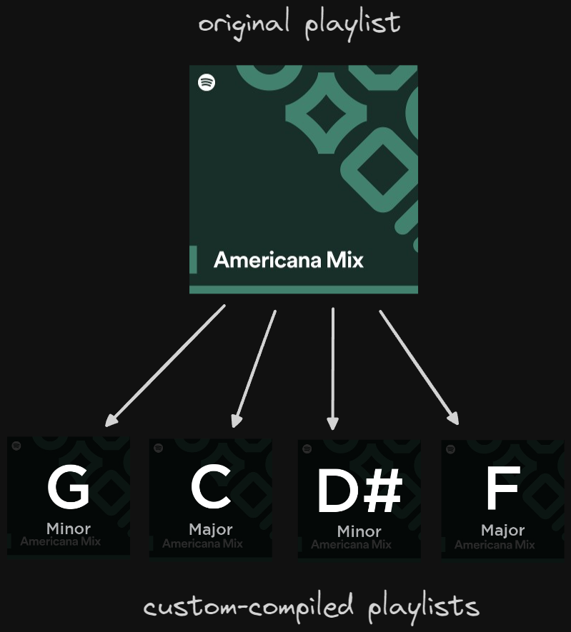

## What is this for?

The Spotify API has an audio analysis [endpoint](https://developer.spotify.com/documentation/web-api/reference/get-audio-analysis) that gives you lots of useful info about a track. Among other things, it gives you its AI prediction of what key and mode a track is in: e.g. **C major**, **A minor**, **G# major**, etc.

This lets you compile playlists based on key & mode, which is useful for people learning a musical instrument. Let's say you're currently learning the **A major** scale on the piano: you could take an existing playlist filled with songs you'd like to learn to play and filter them based on **A major**, compiling the results into a custom playlist. You could also compile a playlist filled with ambient songs to use as backing tracks, filtering them based on key & mode.

## How do I use this?

- This script requires Spotify client credentials (see instructions [here](https://developer.spotify.com/documentation/web-api/tutorials/getting-started#create-an-app)). The `.env` file at the project root expects credentials and a redirect uri. Insert them.
- Then, run `python main.py`. This will trigger a setup script when run for the first time. The setup will involve authenticating yourself into your own Spotify application, giving it access to your account.
- Then, add some playlist IDs (newline-separated) into `playlist_ids.txt`.
- Finally, rerun `python main.py`. This time, you'll be prompted to select a key & mode, as well as tick the playlists you'd like to compile from (tick using whitespace). The newly compiled playlists will appear in your Spotify library.

## Caveats

- The compiled playlists are public by default. If you want to make them private, do it in the Spotify UI itself.
- If you compile from the same playlist more than once, the already-existing compilation will be updated instead of creating a new one.
- If you delete a track from a compiled playlist, it won't be re-added if you run the same compilation script again.
- If you manually add a track to a compiled playlist, it won't disappear after you run the same compilation script again.
- If you delete a track from the original playlist you're compiling from, it won't be removed from the compiled playlist. The logic is that you might be using auto-updating playlists like _Discover Weekly_, in which tracks are regularly removed automatically to be replaced with new ones.
- If you delete a compiled playlist, all its track associations will be forgotten, and you'll be able to rerun the same compilation script again from scratch.
- The tracks in the compiled playlists are sorted based on tempo in ascending order (i.e. the slower tracks are at the top, faster at the bottom).
